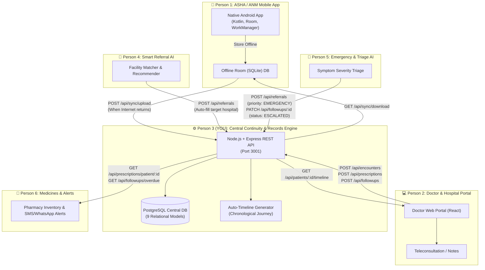
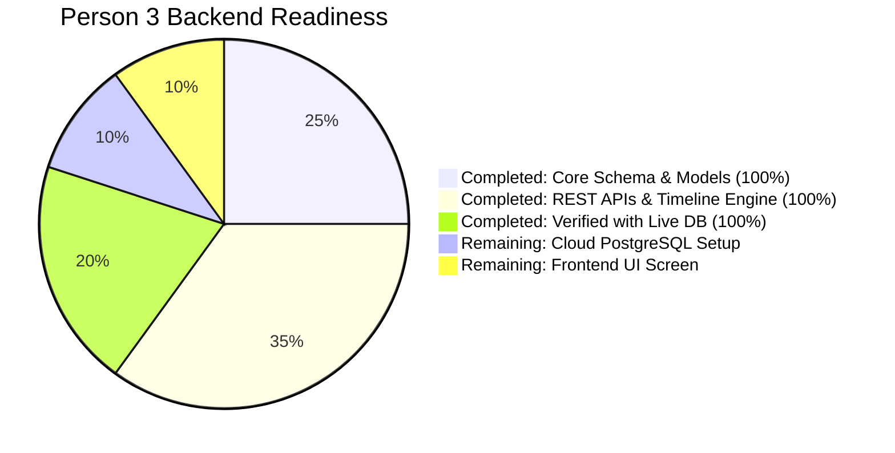

# 🚀 ArogyaLink: Team Progress & Integration Blueprint

---

## 1. System Architecture & Team Flowchart

Here is how all 6 team members interconnect with **Person 3's Central Continuity Engine**:



---

## 2. Progress Tracker: What is Done vs. What is Remaining



### ✅ What is Completed (100% Functional & Verified)
- [x] **Relational Schema (PostgreSQL):** 9 connected tables (`users`, `patients`, `encounters`, `vitals`, `prescriptions`, `referrals`, `referral_events`, `followups`, `timeline_events`).
- [x] **Smart Auto-Timeline Engine:** Every patient interaction automatically creates an audit-logged chronological timeline.
- [x] **Referral Lifecycle Pipeline:** `CREATED` ➔ `ACCEPTED` ➔ `PATIENT_ARRIVED` ➔ `TREATED` ➔ `COMPLETED`.
- [x] **Follow-up Management:** Scheduling, assigning, tracking overdue status, logging clinical outcomes.
- [x] **Mobile Sync Contract:** `POST /api/sync/upload` / `GET /api/sync/download` (client-generated UUID ids, per-record results, optimistic concurrency via `baseUpdatedAt`). The Android app defines its own Room schema; the README sync section is the contract.
- [x] **Developer Bypass Mode:** `AUTH_ENABLED=false` allowing teammates to test freely without login barriers.
- [x] **Automated Dev User Seeding:** Prevents foreign key constraint errors during testing.

### ⏳ What is Remaining (Next Steps)
- [ ] **Cloud Database Setup:** Host PostgreSQL online (Neon.tech or Supabase) so all 6 teammates connect to the same DB.
- [ ] **GitHub Repository:** Push code to GitHub so teammates can pull and clone.
- [ ] **Frontend UI Screen:** Build a clean dashboard (Patient Search + Patient Timeline + Follow-up Tracker).

---

## 3. How Each Teammate Integrates With Your Backend

| Teammate | What They Build | Endpoints They Call on Your Backend | Data Flow |
|---|---|---|---|
| **Person 1** *(ASHA Mobile)* | Native Android app (Kotlin, Room, WorkManager) with offline database | `POST /api/sync/upload`<br>`GET /api/sync/download` | Sends batch offline patient records; downloads updates when internet returns. |
| **Person 2** *(Doctor Portal)* | Web portal for PHC / Teleconsult | `POST /api/encounters`<br>`POST /api/prescriptions`<br>`GET /api/patients/:id/timeline` | Doctor logs diagnosis and medicines; views complete patient medical history. |
| **Person 4** *(Smart Referral AI)* | ML model finding nearest available beds/facilities | `POST /api/referrals`<br>`GET /api/referrals/:id` | AI calculates best hospital and creates smart referral with priority. |
| **Person 5** *(Triage / Emergency)* | Triage assessment & emergency triggers | `POST /api/referrals` (priority: `EMERGENCY`)<br>`PATCH /api/followups/:id` (`status: ESCALATED`) | Escalates worsening rural cases directly to higher facilities. |
| **Person 6** *(Pharmacy & Alerts)* | Medicine stock & SMS reminders | `GET /api/prescriptions/patient/:id`<br>`GET /api/followups/overdue` | Triggers SMS reminders to ASHA/patient when follow-up or medicines are due. |

---

## 4. Frontend Integration Plan

For your hackathon demonstration, you need a web interface to visually show the patient's journey.

### Recommended Structure: Separate Frontend Repo or Client Folder
To avoid git conflicts between backend and frontend team members, you have two options:

#### Option A: Separate Repositories (Recommended for Hackathons)
- `ArogyaLink-Backend` (Current Node.js repo)
- `ArogyaLink-Frontend` (React + Vite + Tailwind CSS repo)
*Benefit:* Backend can be deployed on Render/Railway, and Frontend can be deployed on Vercel independently in 1 click.

#### Option B: Monorepo Folder (Single Repository)
If you prefer everything in one repository:
```
ArogyaLink/
├── ArogyaLink-Backend/   ← (Your current backend)
└── ArogyaLink-Frontend/  ← (Vite + React app)
```

### Key Frontend Screens to Build:
1. **Patient Registry & Search:** Search patient by village, phone, or name (`GET /api/patients?search=...`).
2. **Interactive Patient Timeline:** Chronological cards showing registrations, vitals, prescriptions, and referrals (`GET /api/patients/:id/timeline`).
3. **Hospital Referral Board:** Kanban board of incoming referrals (`CREATED` ➔ `ACCEPTED` ➔ `TREATED`).
4. **ASHA Follow-up Dashboard:** List of pending, overdue, and completed follow-ups (`GET /api/followups/assigned`).
